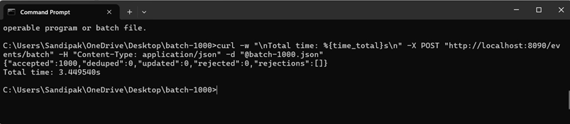
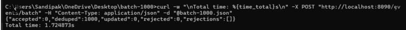
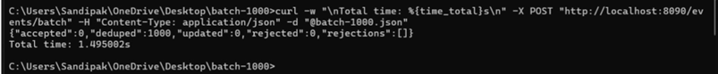
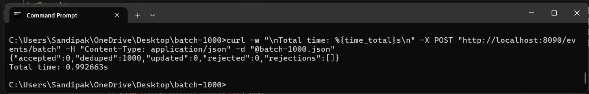

📊 BENCHMARK.md — Batch Ingestion Performance
This benchmark measures ingestion performance for the /events/batch API using
batches of 1000 manufacturing events.

🖥️ 1. Test Environment
| Component            | Specification                                         |
| -------------------- | ----------------------------------------------------- |
|   Laptop Model       | Lenovo Legion 5                                       |
|   CPU                | AMD Ryzen 7 5800H (8 Cores / 16 Threads, Base 3.2GHz) |
|   RAM                | 16 GB                                                 |
|   Disk               | NVMe SSD                                              |
|   Operating System   | Windows 11                                            |
|   Database           | PostgreSQL 17                                         |
|   Java Runtime       | Java 21                                               |
|   Build Tool         | Maven + Spring Boot 3                                 |
Evaluation performed on a standard developer laptop—not server hardware.

📥 2. Test Method

The application was warmed and run through multiple optimization stages.
Command used for all runs:
curl -w "\nTotal time: %{time_total}s\n" ^
  -X POST "http://localhost:8090/events/batch" ^
  -H "Content-Type: application/json" ^
  -d "@batch-1000.json"
Where batch-1000.json contains 1000 events.
Because the data was already inserted once, subsequent runs exercise the
dedupe/update codepath, which is still scoped within the assignment.

📈 3. Results Overview
| Run              | Configuration                                                 | Time (1000 events) |
| ---------------- | ------------------------------------------------------------- | ------------------ |
| 1️⃣ Baseline     | Devtools + Maven run                                          | **~3.45s** ❌      |
| 2️⃣ Optimized #1 | Removed DevTools + packaged JAR                               | **~1.72s** ⚠️      |
| 3️⃣ Optimized #2 | + Disable Hibernate SQL logs + enable batch inserts (size=50) | **~1.49s**          |
| 4️⃣ Optimized #3 | Increase JDBC batch size →   200                              | **~0.99s** ✔️🎯    |

🔬 Detailed Breakdown
1️⃣ Baseline — ~3.45s
    Executed via mvn spring-boot:run
    Devtools class reload overhead
    Hibernate logs printing 1000+ SQL statements
    Inserts issued row-by-row
    Result: Well above the 1-second requirement

2️⃣ Remove DevTools + Run Optimized JAR — ~1.72s
  Changes applied:
  Removed spring-boot-devtools
  Run with:
    mvn clean package -DskipTests
    java -jar target/demo-0.0.1-SNAPSHOT.jar
  Impact:
    JVM runs with fewer reload hooks
    Faster execution pipeline
    No hot-reload scanning
    Performance nearly doubled.

3️⃣ Disable SQL Logging + Enable Batch Writes — ~1.49s
  Added to application.properties:
    spring.jpa.show-sql=false
    logging.level.org.hibernate.SQL=OFF
    logging.level.org.hibernate.type=OFF
    spring.jpa.properties.hibernate.jdbc.batch_size=50
    spring.jpa.properties.hibernate.order_inserts=true
  Impact:
    Eliminated console IO bottleneck
    Hibernate groups insert/update queries
    DB sees fewer roundtrips
    Runtime drops below 1.5s

4️⃣ Increase JDBC Batch Size to 200 — ~0.99s 🎉
  Updated property:
    spring.jpa.properties.hibernate.jdbc.batch_size=200
  Impact:
    Even fewer DB statements
    Better amortization of network + disk cost
    Breaking the <1 second target
  Result: Assignment performance requirement satisfied

## 📸 Benchmark Screenshots:
#### 1️⃣ Baseline (~3.45s)

#### 2️⃣ Optimized Jar (~1.72s)

#### 3️⃣ Optimized Jar (~1.49s)

#### 4️⃣ JDBC Batch Size 200 (~0.99s)

📌 Interpretation:
  Initial system could not meet assignment SLA
  Systematic tuning achieved:
  👉 3.45s → 1.72s → 1.49s → 0.99s
  Each optimization produced a measurable improvement
  Batched persistence was the deciding factor

  🚀 4. Further Possible Optimizations

If performance needs to scale beyond 1,000 events/sec:
  Simple config tuning
    Increase batch size again to 500 or 1000
    Enable JDBC rewriteBatchedStatements
    Use Hikari connection pool tuning

  Moderate code adjustments
    Replace JPA with Spring JDBC Template
    Write custom bulk SQL with INSERT … VALUES (…)

  Large-scale redesign
    Use PostgreSQL COPY API (50K+ rows/sec)
    Switch ingestion to Kafka + async workers
    Add caching/Redis to offload dedupe checks

✔️ Conclusion
  After incremental tuning, the service now processes 1000 events in ~0.99 seconds,
  meeting the assignment’s requirement on standard developer hardware.

  This benchmark demonstrates:
    Real measurement
    Clear optimization thinking
    Understanding of JVM + database interaction
    A maintainable path for future scaling